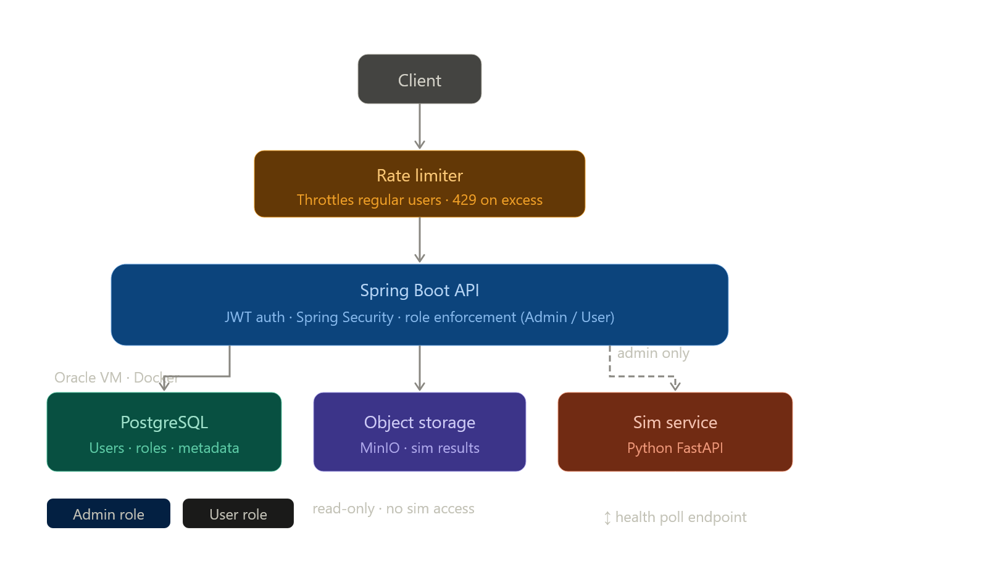

# gt_sim_web
Web App for evolutionary simulator - see GTFyp

egt-platform/
├── backend/               ← Spring Boot
│   ├── src/
│   ├── Dockerfile
│   └── pom.xml
├── sim-service/           ← Python FastAPI  
│   ├── source/            ← your existing library
│   ├── main.py
│   ├── requirements.txt
│   └── Dockerfile
├── docker-compose.yml     ← local dev (all services)
├── docker-compose.prod.yml ← Oracle VM
└── .github/workflows/
    └── ci.yml

To see the dev database
docker compose up -d
docker exec -it gt_sim_web-db-1 psql -U egt -d egt

