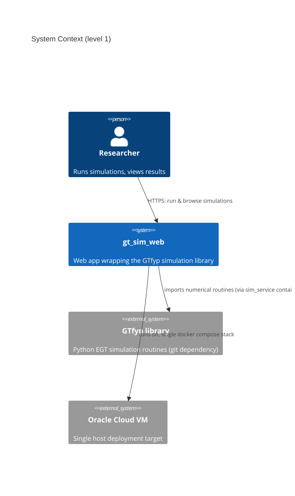
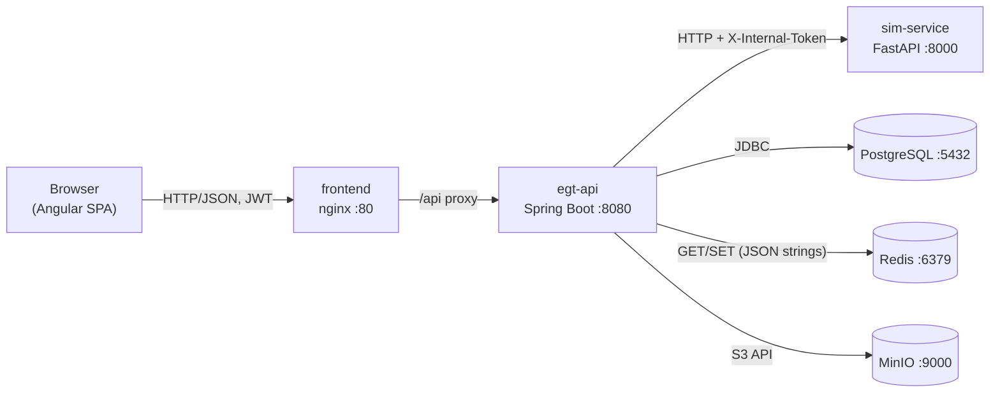
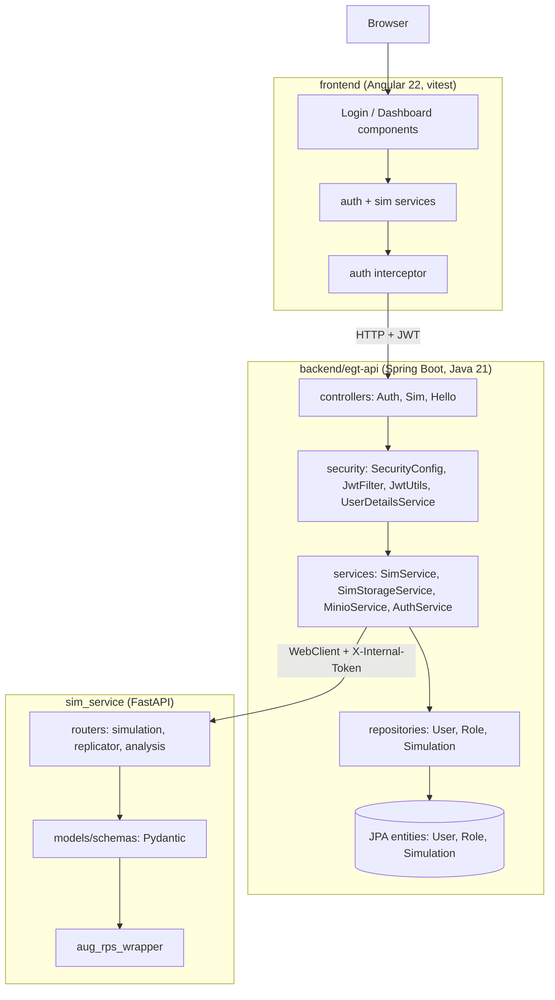
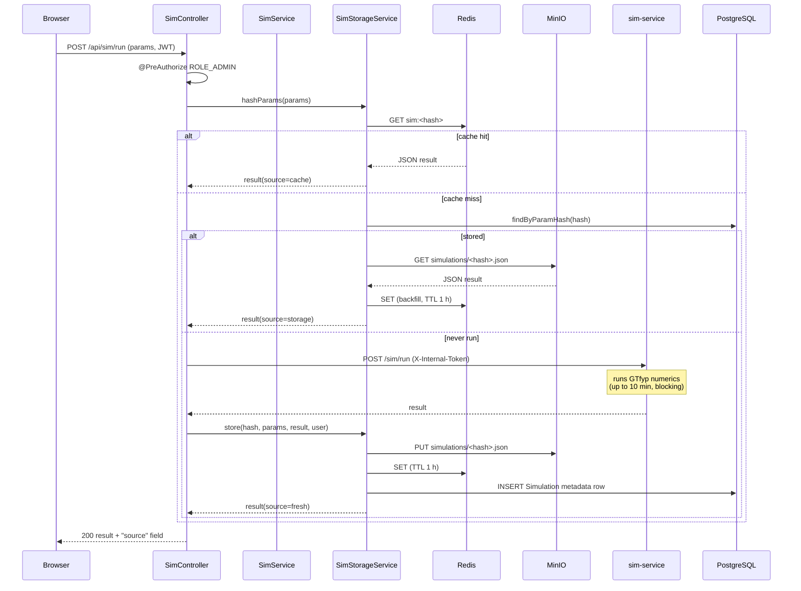
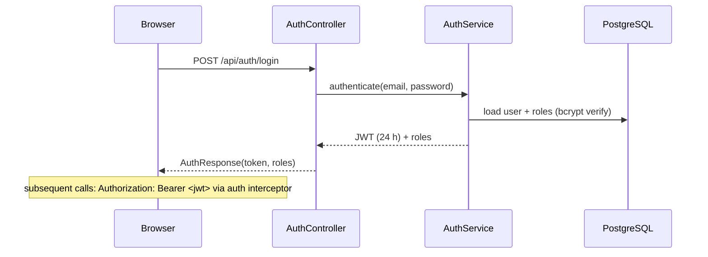
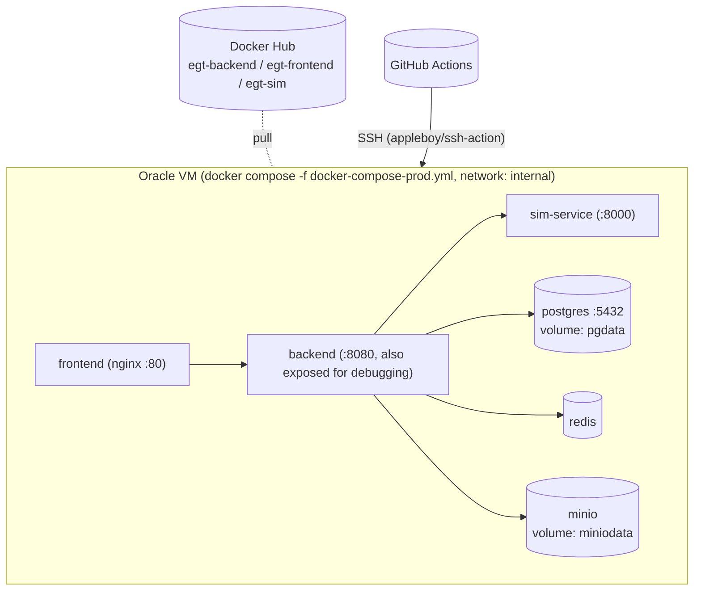
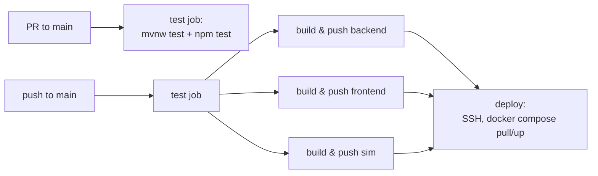

# gt_sim_web — Architecture Documentation (arc42)

Architecture documentation for `gt_sim_web`, following the [arc42](https://arc42.org/) template.

> **Scope note:** This is a **small research application**, not a production platform. It exists so that
> a small research group (effectively single-admin, few users) can run evolutionary game theory (EGT)
> simulations from a browser instead of scripts. Design decisions optimise for simplicity, low
> operational overhead and correctness of results — **not** for scale, high availability or multi-tenancy.
> Section 11 lists the resulting trade-offs explicitly.

---

## 1. Introduction and Goals

### 1.1 Requirements Overview

`gt_sim_web` is a web front end for the numerical routines of the [GTfyp](https://github.com/purgz/GTfyp)
Python library (evolutionary game theory: finite-population processes, replicator dynamics, analysis
tools). It lets an authenticated user:

- configure and run batch simulations (Moran / Local / Fermi processes) and analytical routines
  (replicator trajectories, Fokker–Planck, ΔH ranges, critical-N, fixed points) from the browser,
- benefit from result reuse: identical parameter sets are served from cache or persistent storage
  instead of being recomputed,
- browse previously run simulations and re-fetch their full results.

### 1.2 Quality Goals

| Priority | Quality | Reasoning |
|---|---|---|
| 1 | **Correctness of numerical results** | This is a research tool; a wrong or silently-varying result is worse than a slow one. |
| 2 | **Reproducibility / result reuse** | Simulations can take minutes; identical inputs must return the identical stored result. |
| 3 | **Low operational overhead** | Deployed and operated by one person on a single VM; the whole system must be understandable by one developer. |
| 4 | **Basic multi-user separation** | Users own nothing jointly; results are globally shared, but only admins may trigger compute-heavy runs. |

### 1.3 Stakeholders

| Role | Expectation |
|---|---|
| Researcher / admin | Run simulations interactively, retrieve past results. |
| Regular user | Register, log in, browse saved results. |
| Developer (same person, usually) | Local dev on Windows, deploy via `git push` → CI → Oracle VM. |

### 1.4 Explicit Non-Goals

- Horizontal scaling, load balancing, HA/failover.
- Multi-tenancy or per-user result isolation (results are shared by design).
- Fine-grained authz beyond the two roles `ROLE_ADMIN` / `ROLE_USER`.
- Long-term data governance (no retention policies, no backup automation).

---

## 2. Architecture Constraints

| Constraint | Consequence |
|---|---|
| Deployment target is a single Oracle Cloud free-tier VM | Everything must run as a single `docker compose` stack; no orchestrators (K8s etc.). |
| Developer machine is Windows | Maven wrapper invocation quirks (`.cmd`, exec-bit issues); CI must run Linux. |
| Simulation core is an external Python library (GTfyp) | Must be wrapped as a service; Python version/dependency management stays with that library. |
| Budget: zero | Free-tier VM, Docker Hub for image registry, no paid managed services. |
| Solo maintainer | Prefer boring, mainstream tech over cleverness; avoid distributed transactions and exotic middleware. |

---

## 3. System Scope and Context

### 3.1 Business/Domain Context

### 3.2 Technical Context

| Interface | Protocol | Notes |
|---|---|---|
| Browser ↔ frontend | HTTPS (prod) / HTTP (dev) | JWT in `Authorization: Bearer` header |
| frontend ↔ backend | HTTP `/api/**` | nginx proxies `/api` to `backend:8080` (prod) |
| backend ↔ sim-service | HTTP JSON, header `X-Internal-Token` | shared-secret gate; not exposed externally |
| backend ↔ Postgres | JDBC | results metadata, users, roles |
| backend ↔ Redis | RESP (Spring Data Redis) | result cache, JSON strings, 1 h TTL |
| backend ↔ MinIO | S3 API | full result payloads (`simulations/<hash>.json`) |
| CI ↔ VM | SSH | `appleboy/ssh-action`, `docker compose` pull + up |

---

## 4. Solution Strategy

| Concern | Approach |
|---|---|
| **Overall structure** | Monolithic Spring Boot API + one small compute sidecar (FastAPI) + SPA frontend. Three deployable units, one repository, one pipeline. |
| **Compute offloading** | The JVM never runs simulations; it delegates over HTTP to the Python service that imports GTfyp. Sync request/response with long timeouts — no job queue, no polling, no websockets (see §11). |
| **Result reuse (cache-aside, 3 tiers)** | Params → SHA-256 of JSON-sorted param map → lookup order: Redis (1 h TTL) → MinIO (with Postgres `param_hash` index) → fresh run, then back-fill the cheaper tiers. |
| **Auth & access control** | Stateless JWT (24 h expiry) issued by `/api/auth/login|register`; method-level `@PreAuthorize`; `X-Internal-Token` shared secret between backend and sim-service. |
| **Configuration** | 12-factor style: all secrets/URLs via environment variables, sourced from a gitignored `.env` (dev) / `.env.prod` (VM), imported by both docker compose and Spring (`spring.config.import`). |
| **Build & deploy** | GitHub Actions: PRs and pushes run the test job; pushes to `main` additionally build three images to Docker Hub and deploy to the VM via SSH (`docker compose pull && down && up`). Tests gate deploys. |
| **Data model** | JPA/Hibernate `ddl-auto=update` — schema evolution is manual-casual; acceptable at this scale, volume is tiny. |

---

## 5. Building Block View

### 5.1 Level 1 — Overall System

### 5.2 Level 2 — `backend/egt-api` (the API core)

| Package | Responsibility |
|---|---|
| `controller` | REST endpoints. `AuthController` (`/api/auth/register|login`), `SimController` (`/api/sim/**`: run, replicator, fokker-planck, delta-h-range, critical-n, fixed-point, saved, health), `HelloController` (smoke test). |
| `security` | Spring Security filter chain, stateless JWT: `JwtFilter` (per-request token validation), `JwtUtils` (issue/verify, HS, 24 h), `UserDetailsServiceImpl`, `SecurityConfig` (routes, `@PreAuthorize` enabled). |
| `service` | Domain logic. `SimService` = orchestration + cache-aside flow + WebClient calls to sim-service. `SimStorageService` = param hashing, Redis cache, MinIO persistence, `Simulation` metadata rows. `MinioService` = thin S3 wrapper. |
| `repository` | Spring Data JPA: `UserRepository`, `RoleRepository`, `SimulationRepository` (`findByParamHash`). |
| `model` / `dto` | Entities `User`, `Role`, `Simulation`; request/response DTOs for auth. |
| `config` | `WebClient` + Jackson beans, Redis template, MinIO client, `DataInitaliser` (seeds roles, always on), `DevUserSeeder` (seeds dev users, `dev` profile only). |
| `exception` | `GlobalExceptionHandler` — maps exceptions to HTTP status codes. |

### 5.3 Level 2 — `sim_service` (compute sidecar)

| Building block | Responsibility |
|---|---|
| `main.py` | FastAPI app; mounts routers; exposes unauthenticated `/health`. |
| `routers/simulation.py` | `POST /sim/run` — dispatches to Moran/Local/Fermi batch simulation functions. |
| `routers/replicator.py` | `POST /replicator/trajectory`, `POST /replicator/fokker-planck`. |
| `routers/analysis.py` | `POST /analysis/delta-h-range`, `/analysis/critical-n/analytical`, `/analysis/fixed-point`. |
| `models/schemas.py` | Pydantic request models (`SimRequest`: matrix, process, pop_size, iterations, simulations, w, ...). |
| `aug_rps_wrapper.py` | Glue around the external GTfyp library. |

Every route requires the `X-Internal-Token` header matching `SIM_INTERNAL_TOKEN` (401/403 otherwise);
the backend injects this header on the `WebClient`. The service is stateless and synchronous.

### 5.4 Level 2 — `frontend` (Angular SPA)

| Building block | Responsibility |
|---|---|
| `components/login`, `components/dashboard` | The two screens: authentication, and simulation running/results browsing. |
| `services/auth.ts` | Login/register calls, JWT storage, `isLoggedIn()`. |
| `services/sim.ts` | Calls to `/api/sim/**`, result rendering data. |
| `interceptors/auth-interceptor.ts` | Attaches `Authorization: Bearer` to API calls. |
| `app.routes.ts` | `/login`, `/dashboard` (guarded by `isLoggedIn`), redirect fallbacks. |

Standalone components, Angular 22, built to a static bundle served by nginx in prod.

---

## 6. Runtime View

### 6.1 POST `/api/sim/run` — the central scenario (cache-aside)

The `source` field (`cache` / `storage` / `fresh`) is a debug affordance, kept deliberately.

### 6.2 Login

### 6.3 Browse saved results

`GET /api/sim/saved` returns metadata (id, process, pop_size, w, created_at) from Postgres;
`GET /api/sim/saved/{id}` fetches the full JSON from MinIO by the row's `minio_key`.

---

## 7. Deployment View

### 7.1 Development (developer workstation, Windows)

`docker compose up -d` starts **infrastructure + sim-service only** (Postgres, Redis, MinIO, sim_service);
backend and frontend run on the host for fast feedback:

- backend: `.\mvnw.cmd spring-boot:run "-Dspring-boot.run.profiles=dev"` (port 8080, seeds dev users)
- frontend: `npm start` (port 4200, proxies/calls `http://localhost:8080/api`)

The backend resolves secrets via `spring.config.import=optional:file:./.env[.properties],optional:file:../../.env[.properties]`.
Tests use H2 in-memory and need neither Docker nor real secrets.

### 7.2 Production (single Oracle VM)

- Images: `henrybrooks/egt-backend`, `egt-frontend`, `egt-sim` (`:latest` + `:${sha}`), built only on `main`.
- Only nginx (80), backend (8080, optional) exposed; DB/Redis/MinIO/sim-service on an internal bridge network.
- Persistence: named volumes `pgdata`, `miniodata`. `docker compose down` does **not** remove them.
- Config: `.env.prod` on the VM; `SPRING_JPA_HIBERNATE_DDL_AUTO=update`.
- No container `healthcheck`s and no restart-orchestration beyond `restart: always` — accepted debt.

### 7.3 CI/CD (`​.github/workflows/ci.yml`)

The `test` job runs on every PR and push; `build-*` and `deploy` run only on `main` and deploy depends
on the test job passing.

---

## 8. Cross-cutting Concepts

| Concept | Realisation |
|---|---|
| **Param hashing** | JSON of params sorted into a `TreeMap`, serialised, SHA-256 → hex. Deterministic key shared by all three storage tiers. |
| **Security** | JWT HS-256, 24 h expiry (`jwt.expiration`); roles `ROLE_ADMIN`/`ROLE_USER` seeded at startup by `DataInitaliser`; `@PreAuthorize` on endpoints — compute-heavy and health endpoints are admin-only; passwords bcrypt; sim-service additionally gated by `X-Internal-Token` shared secret. |
| **Caching** | Redis string values (`sim:<sha256>`, JSON), TTL 1 h, back-filled on MinIO hits, failures non-fatal (cache is always optional). |
| **Persistence** | Postgres via JPA; `Simulation` rows carry `param_hash` (unique lookup), `minio_key`, denormalised metadata (process, pop_size, w, matrix) for the saved-list view; payloads live in MinIO, not in the DB. |
| **Configuration & secrets** | Environment variables everywhere; dev `.env` imported by compose *and* Spring; never committed. |
| **Error handling** | `@RestControllerAdvice` `GlobalExceptionHandler`; services throw unchecked exceptions; cache failures swallowed, storage failures bubble up as 5xx. |
| **Timeouts** | Per-endpoint WebClient timeouts (2–15 min, reflecting simulation cost); 3 s for health probe. |
| **Logging** | Lombok `@Slf4j`; no sensitive data in logs. |

---

## 9. Architecture Decisions (condensed ADRs)

| # | Decision | Rationale | Consequences |
|---|---|---|---|
| 1 | **Separate Python compute service behind a thin HTTP boundary** instead of calling GTfyp from JVM (GraalPy/Jython) | GTfyp is a native CPython/numpy library; isolation keeps JVM simple and lets the sim core evolve independently | One more deployable; internal-token trust boundary; sync HTTP only |
| 2 | **Synchronous blocking calls** (WebClient `.block()`) instead of job queue + polling | Researcher sits in front of the screen and waits; minutes-long runs are acceptable UX at this scale; no extra infra (no broker, no worker pool, no task tables) | Request threads tied up up to 10–15 min; no cancellation; server must tolerate long-lived connections (see §11) |
| 3 | **Three-tier cache-aside keyed by param hash** (Redis → MinIO → fresh run) | Simulations are deterministic and expensive; Redis gives fast recent access, MinIO durable unlimited results, Postgres only metadata | Redis is disposable; MinIO is the source of truth for results; hash collisions (practically) impossible, but param-map normalisation is implicit (JSON of sorted map) |
| 4 | **Results are globally shared, not per-user** | Research data, not user data; avoids ownership modelling | Any authenticated user can list/fetch all saved runs; admins trigger runs |
| 5 | **`ddl-auto=update`** instead of migrations (Flyway/Liquibase) | Solo dev, low churn schema | Schema drift possible between environments; no rollback story |
| 6 | **Deploy = SSH + `docker compose`** instead of any orchestration | Single free-tier VM; operator is the developer | Downtime during deploy (`down` then `up`); acceptable |
| 7 | **JWT in localStorage-style client state, stateless backend** | No session affinity needed; simplest viable auth | No logout/revocation before expiry; token theft until 24 h expiry |
| 8 | **Dev-profile seeding of test users** (`DevUserSeeder`) | Convenient local logins; strictly `@Profile("dev")` so prod never seeds | Prod registration is open (`/api/auth/register`) — intentional for a small trusted user base |

---

## 10. Quality Requirements

### 10.1 Quality Scenario Table (priorities from §1.2)

| Scenario | Quality | Response measure |
|---|---|---|
| Same params submitted twice within 1 h | Reuse | 2nd call returns identical JSON, `source: cache`, without contacting sim-service |
| Same params after 1 h, weeks later | Correctness / reuse | Result served from MinIO, `source: storage`, bit-identical to first run |
| sim-service down | Robustness (partial) | `GET /api/sim/health` reports `down`; cached/stored results still served; fresh runs fail with 5xx |
| Redis down | Robustness | All runs proceed fresh; caching failures logged and ignored |
| Restart of backend | Durability | Users, roles, saved results intact (Postgres, MinIO, volumes) |
| Regression in auth/sim endpoints | Maintainability | Test suites (JUnit/H2, vitest) run on every PR and gate deploy |

### 10.2 Explicitly *not* targeted

Latency under heavy concurrent load, horizontal scalability, graceful degradation of the whole
system (only the paths above), audit trails, GDPR-style data lifecycle management.

---

## 11. Risks and Technical Debts

| Risk / Debt | Impact | Mitigation status |
|---|---|---|
| **Long blocking HTTP** between browser ↔ backend ↔ sim-service (up to 10–15 min) | `frontend/nginx.conf` allows 600 s (`proxy_read_timeout`), but the WebClient timeout for `/analysis/delta-h-range` is 15 min — runs longer than 10 min will be cut by nginx; also ties up server threads; no cancellation or progress feedback | Accepted for now; a job queue + polling API is the obvious next step if runs get longer or users increase |
| **`Map<String, Object>` contracts** between backend and sim-service, and Pydantic only on the Python side | Typos in param names surface at runtime; `source` field added ad hoc | schemas.py exists for requests; Java side untyped by choice |
| **`ddl-auto=update` in prod** | Schema never shrinks; risky renames | Accepted; revisit if schema churn grows |
| **No pagination** on `GET /api/sim/saved` (`findAllByOrderByCreatedAtDesc`) | Fine for hundreds of rows; will degrade if the research generates tens of thousands | Known; add paging when needed |
| **No container healthchecks, no restart supervision beyond `restart: always`** | A wedged sim-service stays wedged | Manual `docker compose ps` monitoring; single-operator reality |
| **Single VM, no HA** | VM outage = full outage | Accepted (research tool); pgdata/miniodata volumes make data survivable |
| **Open registration + shared results in prod** | Any registrant can list all results; only run-triggering is admin-gated | Intentional for a trusted, small user group |
| **`.env` management is manual** | No secret rotation, no vault | Documented in README; acceptable for solo operation |
| **Loose bits**: `HelloController` leftover, README `image.png` screenshot, inconsistent naming (`DataInitaliser` typo, `docker-compose-prod.yml` vs `.prod.yml` style) | Cosmetic | Low priority |

---

## 12. Glossary

| Term | Meaning |
|---|---|
| **EGT** | Evolutionary Game Theory — the research domain; finite-population stochastic processes over payoff matrices. |
| **GTfyp** | The external Python library containing the numerical routines (git dependency of `sim_service`). |
| **egt-api** | The Spring Boot backend (`backend/egt-api`); owns auth, persistence, caching, orchestration. |
| **sim-service** | The FastAPI compute service (`sim_service`); wraps GTfyp, stateless, internal-only. |
| **Process** | Simulation type: `Moran`, `Local`, `Fermi` finite-population update processes. |
| **Param hash** | SHA-256 over the JSON-serialised, key-sorted parameter map; primary key across Redis/MinIO/Postgres for result identity. |
| **`source`** | Field appended to simulation responses: `cache`, `storage`, or `fresh`. |
| **Internal token** | `X-Internal-Token` shared secret (env `SIM_INTERNAL_TOKEN`) gating backend → sim-service calls. |
| **RPS** | Replicator dynamics reference from GTfyp (used in `aug_rps_wrapper`). |
| **MinIO** | S3-compatible object store holding full simulation result JSON; bucket `simulations`. |
